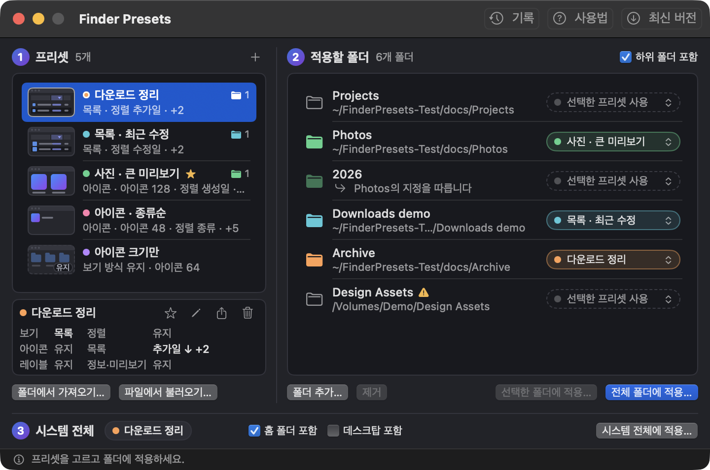
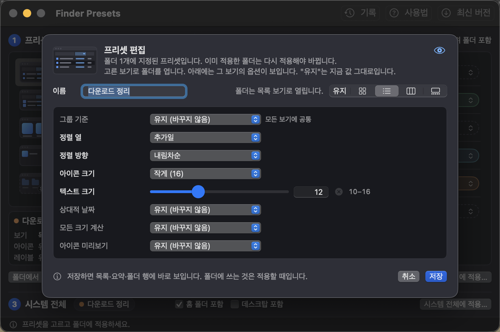
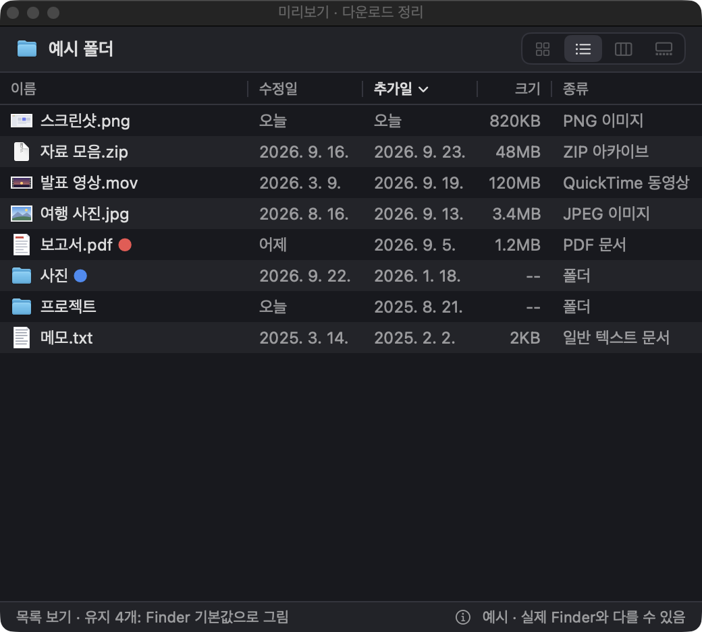
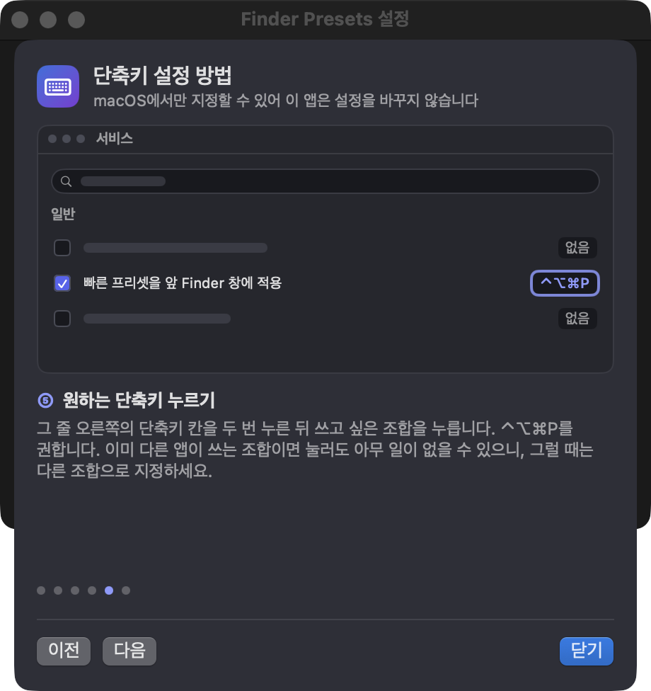
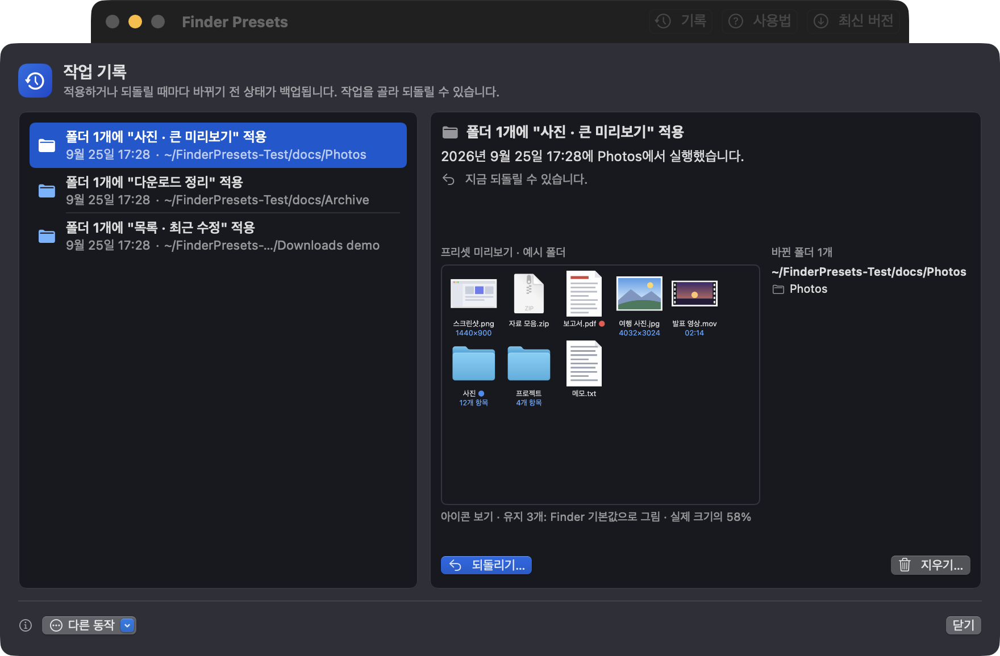

# Finder Presets

<p align="center">
  
</p>

[English README](README.md)

Finder 보기를 프리셋으로 저장해 두고, 원하는 폴더와 그 하위 폴더, 또는 Finder 기본 보기에 한 번에 적용하는 macOS 앱입니다.

<p align="center">
  
</p>

## 내려받기

**[최신 DMG 내려받기](https://github.com/hyunseop827/finder-presets/releases/latest/download/FinderPresets.dmg)** · 무료 · Apple Silicon · macOS 14 이상

- **설치:** DMG를 열고 **Finder Presets**를 **응용 프로그램** 폴더로 끌어다 놓습니다.
- **업데이트:** 앱을 종료하고 새 DMG의 앱으로 바꿉니다.
- **처음 실행:** ad-hoc 서명만 되어 있고 Apple 공증을 받지 않았습니다. macOS가 막으면 한 번 열어 본 뒤 **시스템 설정 → 개인정보 보호 및 보안 → 그래도 열기**를 누르세요([Apple 안내](https://support.apple.com/ko-kr/guide/mac-help/mh40616/mac)).
- **Finder 권한:** 앱이 처음 Finder를 다시 시작할 때 Finder 제어를 허용할지 물으면 허용하세요.
- **변경 사항:** [릴리스 노트](https://github.com/hyunseop827/finder-presets/releases)에서 볼 수 있습니다.

<details>
<summary>내려받은 파일 확인하기</summary>

```zsh
curl -LO https://github.com/hyunseop827/finder-presets/releases/latest/download/FinderPresets.dmg
curl -LO https://github.com/hyunseop827/finder-presets/releases/latest/download/FinderPresets.dmg.sha256
shasum -a 256 -c FinderPresets.dmg.sha256
```

</details>

## 기능

<table>
  <tr>
    <td width="50%"></td>
    <td width="50%"><b>실제 폴더로 프리셋 만들기</b><br><br>보기를 맞춰 둔 폴더를 끌어다 놓거나 편집기에서 직접 만듭니다. 아이콘·목록·컬럼·갤러리 보기, 아이콘·텍스트 크기, 정렬, 그룹 기준 등 모든 보기 옵션을 정할 수 있고, "유지"로 둔 옵션은 그대로 남습니다.</td>
  </tr>
  <tr>
    <td width="50%"><b>실시간 미리보기</b><br><br>편집하는 동안 예시 폴더를 프리셋대로 그려 보여 주니, 적용하기 전에 결과를 확인할 수 있습니다.</td>
    <td width="50%"></td>
  </tr>
  <tr>
    <td width="50%"></td>
    <td width="50%"><b>빠른 적용 단축키</b><br><br>프리셋에 별표를 하고 ⌃⌥⌘P 같은 단축키를 누르면 맨 앞 Finder 창의 폴더에 바로 적용됩니다. 단축키 지정 방법은 단계별 안내로 보여 줍니다.</td>
  </tr>
  <tr>
    <td width="50%"><b>기록과 되돌리기</b><br><br>바꾸기 전에 항상 백업합니다. <b>기록</b>에서 원하는 작업을 골라 되돌릴 수 있습니다.</td>
    <td width="50%"></td>
  </tr>
</table>

- **폴더마다 다른 프리셋:** 폴더마다 프리셋을 지정해 선택한 폴더나 전체 폴더에 적용합니다. 하위 폴더 포함 여부도 고릅니다.
- **시스템 전체 적용:** Finder 기본 보기와, 원하면 홈 폴더까지 한 번에 바꿉니다.
- **Finder 재시작 자동:** 필요할 때 앱이 Finder를 다시 시작하고, 열려 있던 Finder 창도 다시 엽니다.
- **Finder 오른쪽 클릭 메뉴:** Finder의 서비스 메뉴에서 폴더 추가, 프리셋 만들기, 적용을 할 수 있습니다.
- **한국어와 영어 지원**

## 개인정보

- **네이티브:** Swift/SwiftUI로 만들었고, 백그라운드 프로세스·메뉴 막대 상주·로그인 항목이 없습니다.
- **오프라인:** 네트워크 요청, 계정, 사용 통계 수집이 없습니다. **최신 버전** 버튼은 릴리스 페이지를 브라우저로 열 뿐입니다.
- **안전한 쓰기:** 적용하는 폴더의 Finder 보기 설정(`.DS_Store`)만, 백업한 뒤에 씁니다. Finder 스크립트로 설정을 바꾸지 않습니다.
- **로컬 데이터:** 프리셋, 폴더 목록, 작업 기록과 백업은 `~/Library/Application Support/FinderPresets`에 둡니다.

## 삭제

- 앱을 종료하고 `/Applications/Finder Presets.app`을 휴지통으로 옮깁니다.
- 데이터까지 지우려면 `~/Library/Application Support/FinderPresets` 폴더를 지우고 `defaults delete com.hyunseop.FinderPresets`를 실행합니다.
- 프리셋을 적용한 폴더는 그 보기를 유지합니다. 원래대로 돌리려면 먼저 **기록**에서 되돌리세요.

## 개발

```sh
./scripts/build-app.sh [debug|release]   # build/Finder Presets.app
./scripts/test.sh                        # 단위 테스트
./scripts/make-dmg.sh [version]          # build/FinderPresets-<version>.dmg
```

- **필요 환경:** Xcode 26 이상(Swift 6.2).
- **릴리스:** `Resources/Info.plist`의 버전을 올리고 `.github/release-notes.md`에 바뀐 점을 적습니다(첫 줄 `# v<버전>`). `main`에 푸시해 CI를 통과하면 CI가 `v<버전>` 태그를 달고 DMG를 만들어 릴리스를 올립니다. 버전을 올리지 않고 앱을 바꾸면 CI가 실패합니다.
- **테스트 데이터:** 개발 중에는 `FINDER_PRESETS_DATA_DIR`로 다른 폴더를 지정해 실제 프리셋과 기록을 건드리지 않게 합니다.

## 라이선스

- [MIT](LICENSE): 자유롭게 쓰고, 고치고, 배포할 수 있습니다. 보증은 없습니다.
- `.DS_Store` 파일은 [sindresorhus/DSStore](https://github.com/sindresorhus/DSStore)(MIT)로 읽고 씁니다.
