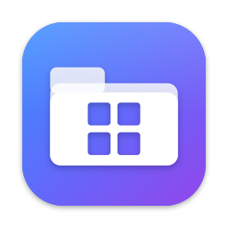
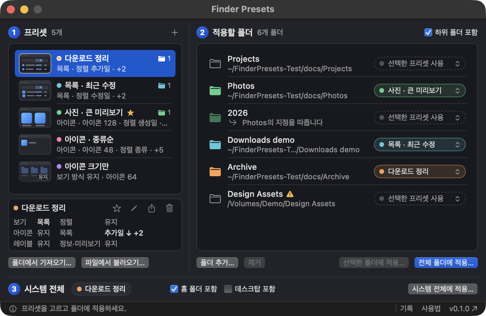
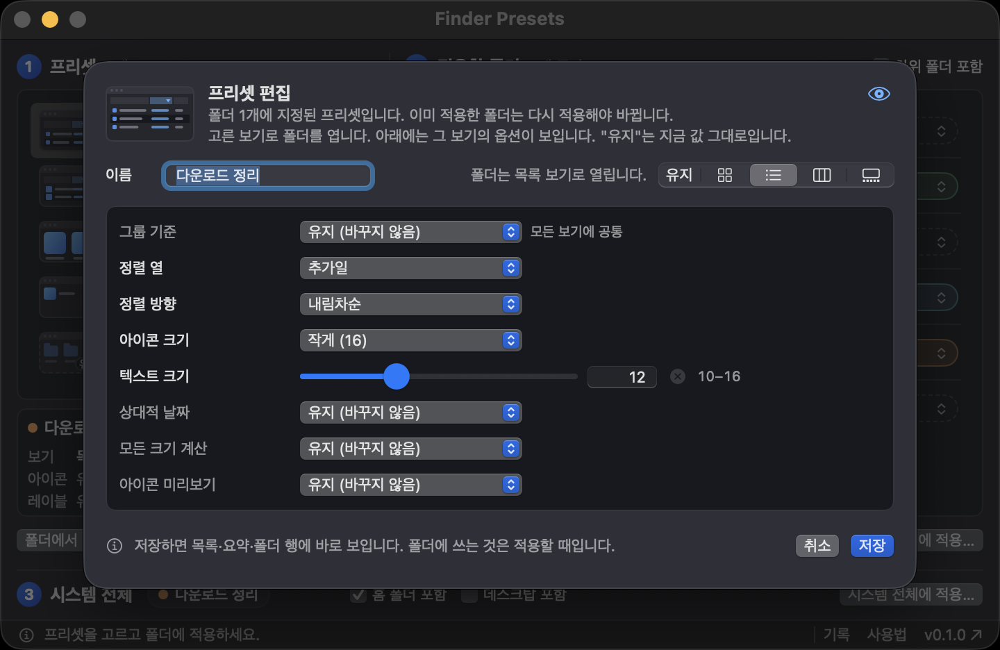
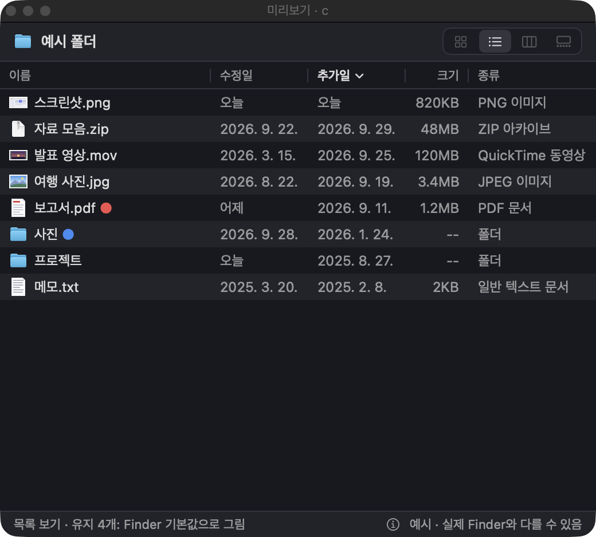
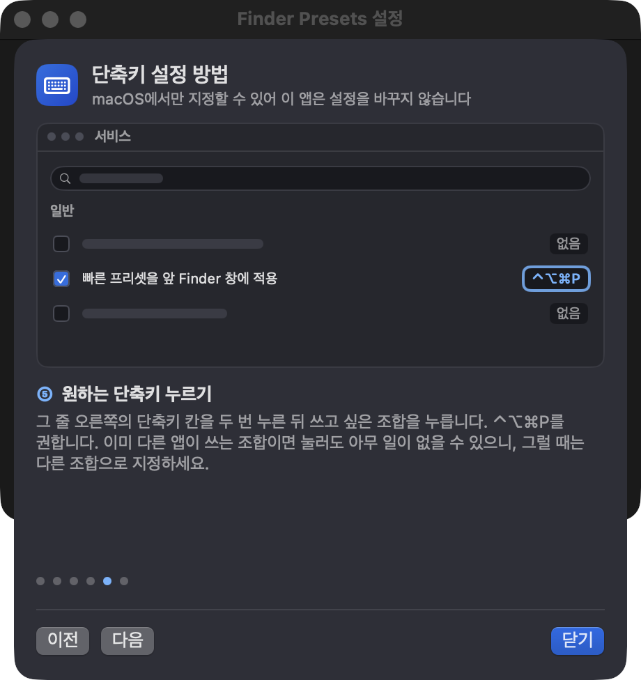
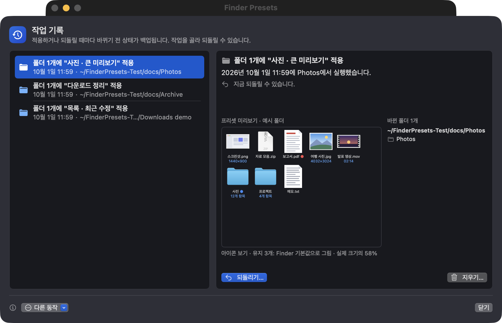

# Finder Presets

<p align="center">
  
</p>

[English README](README.md)

Finder 보기를 프리셋으로 저장해 두고, 원하는 폴더와 그 하위 폴더, 또는 Finder 기본 보기에 한 번에 적용하는 macOS 앱입니다.

<p align="center">
  
</p>

## 내려받기

**[최신 DMG 내려받기](https://github.com/hyunseop827/finder-presets/releases/latest/download/FinderPresets.dmg)** · 무료 · Apple Silicon · macOS 14 이상

- **설치:** DMG를 열고 **Finder Presets**를 **응용 프로그램** 폴더로 끌어다 놓습니다.
- **업데이트:** 0.3.0부터는 앱 안에서 업데이트할 수 있습니다. **Finder Presets → 업데이트 확인…**(또는 창 오른쪽 아래의 **업데이트 확인**)을 누르면 바로 확인하고, 앱이 켜져 있는 동안에는 하루에 한 번 앱이 스스로 확인하기도 합니다. 새 버전이 있으면 바뀐 점을 보여 주고 설치할지 물어봅니다. **업데이트 설치**를 골라야만 새 버전을 내려받고, 받은 파일의 서명을 확인한 뒤 앱을 바꾸고 다시 엽니다. 앱은 꼭 **응용 프로그램** 폴더로 옮겨서 쓰세요. DMG 안에서 바로 연 앱은 스스로 업데이트하지 못합니다. 0.3.0 이전 버전에는 이 기능이 없으니 한 번만 새 DMG의 앱으로 바꾸세요.
- **처음 실행:** ad-hoc 서명만 되어 있고 Apple 공증을 받지 않았습니다. macOS가 막으면 한 번 열어 본 뒤 **시스템 설정 → 개인정보 보호 및 보안 → 그래도 열기**를 누르세요([Apple 안내](https://support.apple.com/ko-kr/guide/mac-help/mh40616/mac)).
- **Finder 권한:** 앱이 처음 Finder를 다시 시작할 때 Finder 제어를 허용할지 물으면 허용하세요.
- **변경 사항:** [릴리스 노트](https://github.com/hyunseop827/finder-presets/releases)에서 볼 수 있습니다.

<details>
<summary>내려받은 파일 확인하기</summary>

```zsh
curl -LO https://github.com/hyunseop827/finder-presets/releases/latest/download/FinderPresets.dmg
curl -LO https://github.com/hyunseop827/finder-presets/releases/latest/download/FinderPresets.dmg.sha256
shasum -a 256 -c FinderPresets.dmg.sha256
```

</details>

## 기능

<table>
  <tr>
    <td width="50%"></td>
    <td width="50%"><b>실제 폴더로 프리셋 만들기</b><br><br>보기를 맞춰 둔 폴더를 끌어다 놓거나 편집기에서 직접 만듭니다. 아이콘·목록·컬럼·갤러리 보기, 아이콘·텍스트 크기, 정렬, 그룹 기준 등 모든 보기 옵션을 정할 수 있고, "유지"로 둔 옵션은 그대로 남습니다.</td>
  </tr>
  <tr>
    <td width="50%"><b>실시간 미리보기</b><br><br>편집하는 동안 예시 폴더를 프리셋대로 그려 보여 주니, 적용하기 전에 결과를 확인할 수 있습니다.</td>
    <td width="50%"></td>
  </tr>
  <tr>
    <td width="50%"></td>
    <td width="50%"><b>빠른 적용 단축키</b><br><br>프리셋에 별표를 하고 ⌃⌥⌘P 같은 단축키를 누르면 맨 앞 Finder 창의 폴더에 바로 적용됩니다. 단축키 지정 방법은 단계별 안내로 보여 줍니다.</td>
  </tr>
  <tr>
    <td width="50%"><b>기록과 되돌리기</b><br><br>바꾸기 전에 항상 백업합니다. <b>기록</b>(⌘Y)에서 원하는 작업을 골라 되돌릴 수 있습니다.</td>
    <td width="50%"></td>
  </tr>
</table>

- **폴더마다 다른 프리셋:** 폴더마다 프리셋을 지정해 선택한 폴더나 전체 폴더에 적용합니다. 하위 폴더 포함 여부도 고릅니다.
- **시스템 전체 적용:** Finder 기본 보기와, 원하면 홈 폴더까지 한 번에 바꿉니다.
- **Finder 재시작 자동:** 필요할 때 앱이 Finder를 다시 시작하고, 열려 있던 Finder 창도 다시 엽니다.
- **Finder 오른쪽 클릭 메뉴:** Finder의 서비스 메뉴에서 폴더 추가, 프리셋 만들기, 적용을 할 수 있습니다.
- **라이트·다크 모드:** macOS의 모양 설정을 따릅니다.
- **한국어와 영어 지원**

## 개인정보

- 계정이 없고 사용 기록을 모으지 않습니다.
- 앱이 인터넷에 연결하는 것은 업데이트 확인뿐입니다. 앱이 켜져 있는 동안 하루에 한 번, 그리고 **업데이트 확인…**을 누를 때 GitHub에서 최신 릴리스의 업데이트 목록(`appcast.xml`)을 읽습니다. 사용자의 파일에 대한 정보는 보내지 않습니다.
- 새 버전 파일(DMG)은 설치를 고를 때만 GitHub에서 내려받습니다. 받은 파일은 열기 전에 앱에 들어 있는 서명 키(EdDSA)로 확인합니다. 업데이트에는 [Sparkle](https://sparkle-project.org)을 씁니다.
- Sparkle은 앱의 환경설정에 약간의 상태를 저장합니다(마지막으로 확인한 때, 건너뛴 버전, 창 위치).
- **네이티브:** Swift/SwiftUI로 만들었고, 백그라운드 프로세스·메뉴 막대 상주·로그인 항목이 없습니다.
- **안전한 쓰기:** 적용하는 폴더의 Finder 보기 설정(`.DS_Store`)만, 백업한 뒤에 씁니다. Finder 스크립트로 설정을 바꾸지 않습니다.
- **로컬 데이터:** 프리셋, 폴더 목록, 작업 기록과 백업은 `~/Library/Application Support/FinderPresets`에 둡니다.

## 삭제

- 앱을 종료하고 `/Applications/Finder Presets.app`을 휴지통으로 옮깁니다.
- 데이터까지 지우려면 `~/Library/Application Support/FinderPresets`, `~/Library/Caches/com.hyunseop.FinderPresets`, `~/Library/HTTPStorages/com.hyunseop.FinderPresets` 폴더를 지우고 `defaults delete com.hyunseop.FinderPresets`를 실행합니다.
- 프리셋을 적용한 폴더는 그 보기를 유지합니다. 원래대로 돌리려면 먼저 **기록**에서 되돌리세요.

## 개발

```sh
./scripts/build-app.sh [debug|release]   # build/Finder Presets.app
./scripts/test.sh                        # 단위 테스트
./scripts/make-dmg.sh [version]          # build/FinderPresets-<version>.dmg
FINDER_PRESETS_DATA_DIR=/tmp/fp swift run finder-presets   # 개발용 CLI (테스트 폴더에 계획·적용·되돌리기)
```

- **필요 환경:** Xcode 26 이상(Swift 6.2).
- **릴리스:** 새 버전은 `main`에서 CI가 올립니다. 변경이 그곳까지 가는 과정은 [AGENTS.md](AGENTS.md)에 있습니다.
- **테스트 데이터:** 개발 중에는 `FINDER_PRESETS_DATA_DIR`로 다른 폴더를 지정해 실제 프리셋과 기록을 건드리지 않게 합니다.
- **UI 검사:** debug 빌드는 `--layout-probe`(고정 레이아웃, 두 언어, 라이트·다크)와 `--selftest`(앱 흐름 전체)를 실행할 수 있습니다. 방법은 [AGENTS.md](AGENTS.md)에 있습니다.

## AI로 만든 과정

기획과 판단은 제가 하고, 구현은 AI 코딩 에이전트(Claude Code)와 함께 했습니다. 결과는 단위 테스트 249개, CI, 앱 안의 레이아웃 검사, 실제 Finder에서 한 직접 테스트로 확인했습니다. 작업 방식과 주요 결정은 [만든 과정](docs/AI_DEVELOPMENT.ko.md)에 있고, 에이전트는 [AGENTS.md](AGENTS.md)의 작업 규칙을 따릅니다.

## 라이선스

- [MIT](LICENSE): 자유롭게 쓰고, 고치고, 배포할 수 있습니다. 보증은 없습니다.
- `.DS_Store` 파일은 [sindresorhus/DSStore](https://github.com/sindresorhus/DSStore)(MIT)로 읽고 씁니다.
- 업데이트는 [Sparkle](https://github.com/sparkle-project/Sparkle)(MIT)로 합니다.
