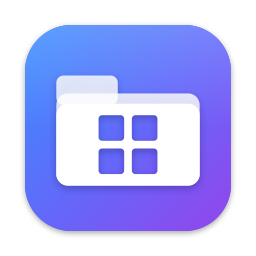
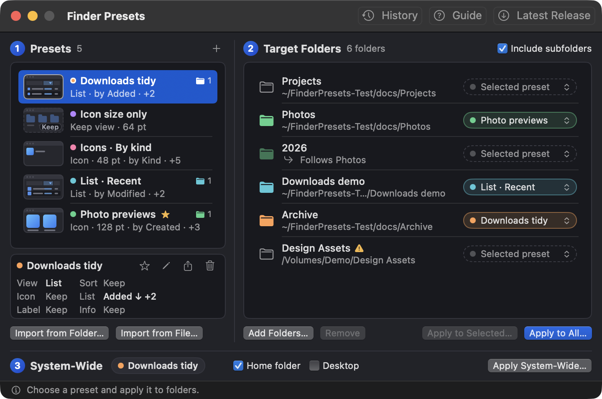
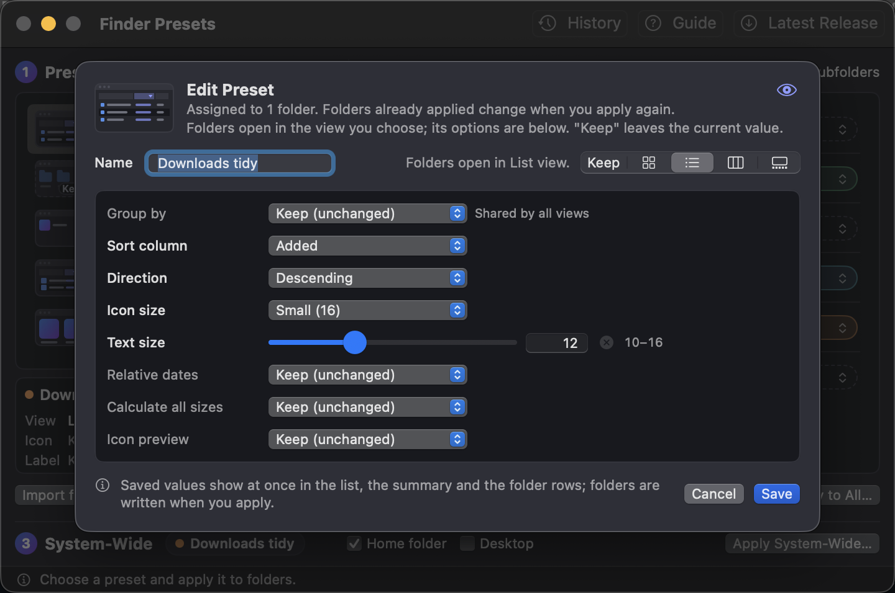
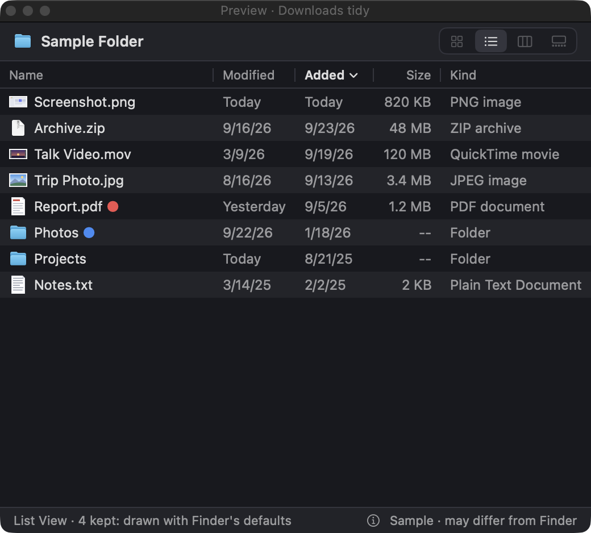
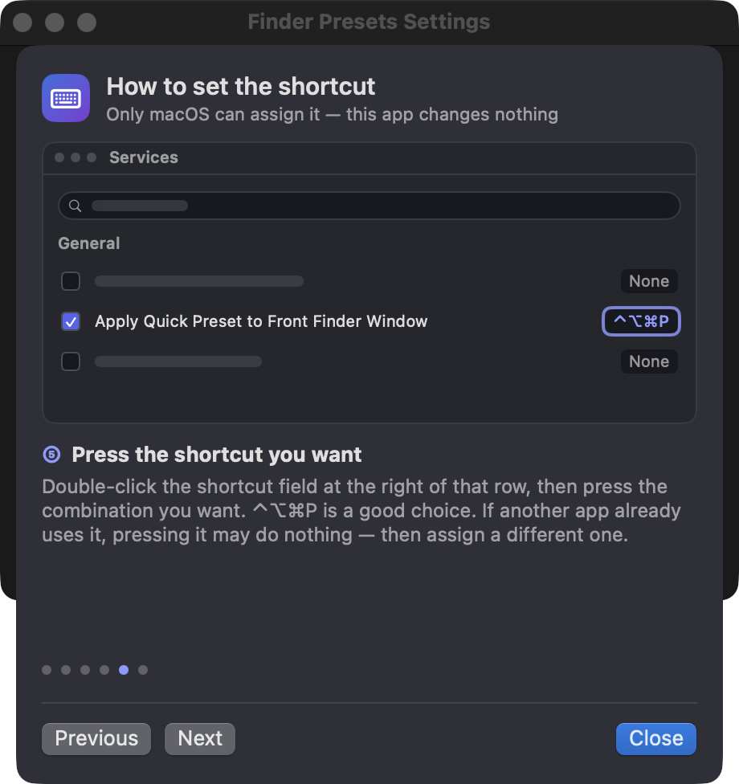
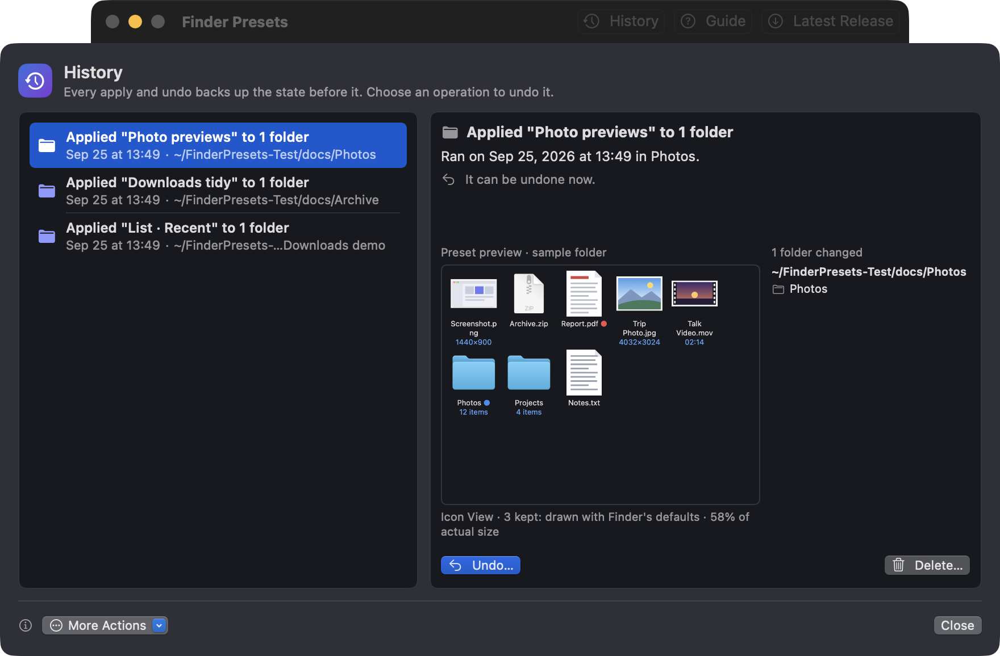

# Finder Presets

<p align="center">
  
</p>

[한국어 README](README.ko.md)

Save a Finder view as a preset and apply it to any folder, to all its subfolders, or to Finder's default view in one click.

<p align="center">
  
</p>

## Download

**[Download the latest DMG](https://github.com/hyunseop827/finder-presets/releases/latest/download/FinderPresets.dmg)** · Free · Apple Silicon · macOS 14 or later

- **Install:** open the DMG and drag **Finder Presets** to **Applications**.
- **Update:** quit the app and replace it with the one from the new DMG.
- **First launch:** the app is ad-hoc signed and not notarized by Apple. If macOS blocks it, try opening it once, then choose **System Settings → Privacy & Security → Open Anyway** ([Apple's instructions](https://support.apple.com/guide/mac-help/mh40616/mac)).
- **Finder permission:** when the app first restarts Finder, macOS asks to let it control Finder. Allow it.
- **What's new:** see the [release notes](https://github.com/hyunseop827/finder-presets/releases).

<details>
<summary>Verify the download checksum</summary>

```zsh
curl -LO https://github.com/hyunseop827/finder-presets/releases/latest/download/FinderPresets.dmg
curl -LO https://github.com/hyunseop827/finder-presets/releases/latest/download/FinderPresets.dmg.sha256
shasum -a 256 -c FinderPresets.dmg.sha256
```

</details>

## Features

<table>
  <tr>
    <td width="50%"></td>
    <td width="50%"><b>Presets from real folders</b><br><br>Drag in a folder you already arranged, or build a preset in the editor. Set any view option: icon, list, column or gallery view, icon and text size, sorting, grouping and more. Options left on "Keep" stay as they are.</td>
  </tr>
  <tr>
    <td width="50%"><b>Live preview</b><br><br>While you edit, a sample folder is drawn with the preset, so you see the result before you apply it.</td>
    <td width="50%"></td>
  </tr>
  <tr>
    <td width="50%"></td>
    <td width="50%"><b>Quick preset shortcut</b><br><br>Star a preset and press a shortcut such as ⌃⌥⌘P to apply it to the front Finder window's folder. A step-by-step guide shows where to set the shortcut.</td>
  </tr>
  <tr>
    <td width="50%"><b>History and undo</b><br><br>Every change is backed up first. Pick any operation in History and undo it.</td>
    <td width="50%"></td>
  </tr>
</table>

- **Per-folder presets:** give each folder its own preset and apply to the selected folders or all of them, with or without subfolders.
- **System-wide:** change Finder's default view and, optionally, your home folder in one step.
- **Finder restarts for you:** the app restarts Finder when needed and reopens your Finder windows.
- **Finder right-click menu:** add folders, make presets or apply from Finder's Services menu.
- **English and Korean**

## Privacy

- **Native:** Swift/SwiftUI; no background process, menu bar agent or login item.
- **Offline:** no network requests, accounts or telemetry. **Latest Release** only opens the releases page in your browser.
- **Careful writes:** changes only the Finder view settings (`.DS_Store`) of the folders you apply to, after backing them up, never through Finder scripting.
- **Local data:** presets, the folder list and the history with its backups stay in `~/Library/Application Support/FinderPresets`.

## Removal

- Quit the app and move `/Applications/Finder Presets.app` to Trash.
- To remove its data too, delete `~/Library/Application Support/FinderPresets` and run `defaults delete com.hyunseop.FinderPresets`.
- Folders keep the views you applied. To get the old views back, undo them in **History** first.

## Development

```sh
./scripts/build-app.sh [debug|release]   # build/Finder Presets.app
./scripts/test.sh                        # unit tests
./scripts/make-dmg.sh [version]          # build/FinderPresets-<version>.dmg
```

- **Requires** Xcode 26 or later (Swift 6.2).
- **Releases:** raise the version in `Resources/Info.plist` and write the changes in `.github/release-notes.md` (first line `# v<version>`). Once the push to `main` passes CI, CI tags `v<version>`, builds the DMG and publishes the release. Changing the app without a new version fails CI.
- **Test data:** set `FINDER_PRESETS_DATA_DIR` to another folder so development runs don't touch your real presets and history.

## License

- [MIT](LICENSE): use, modify, and distribute freely; provided as-is without warranty.
- Reads and writes `.DS_Store` files with [sindresorhus/DSStore](https://github.com/sindresorhus/DSStore) (MIT).
